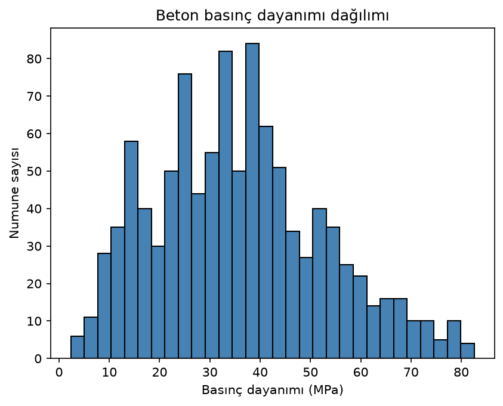
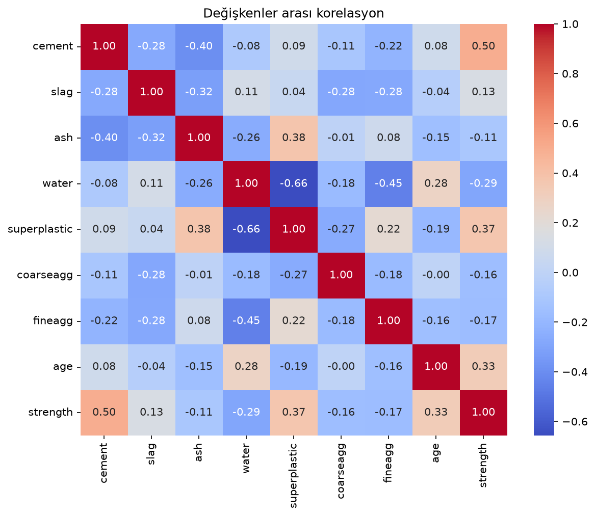
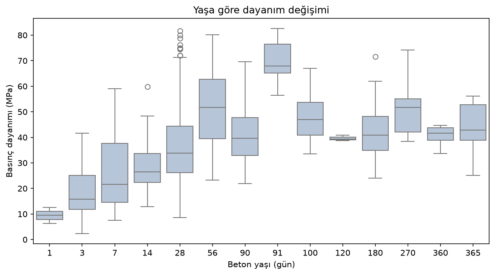
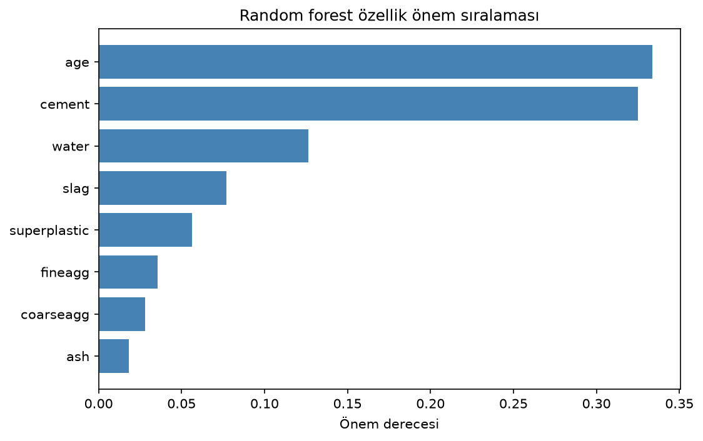
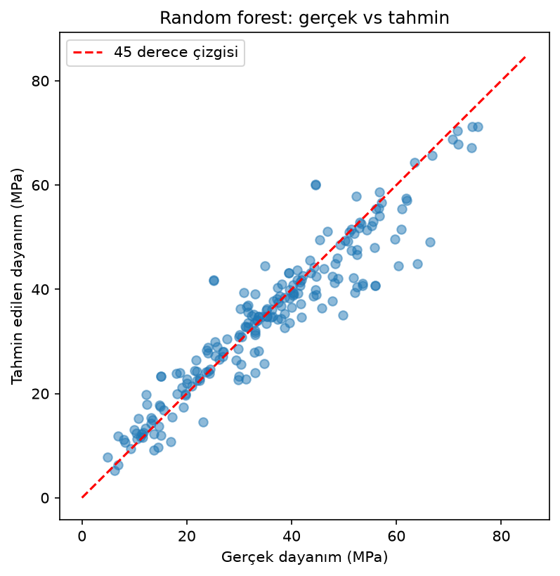
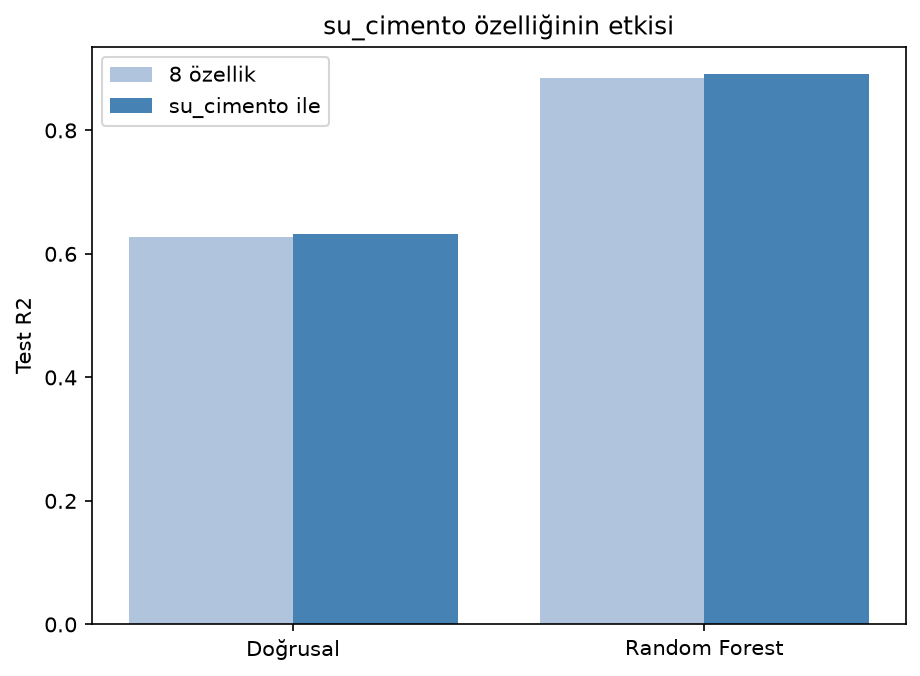
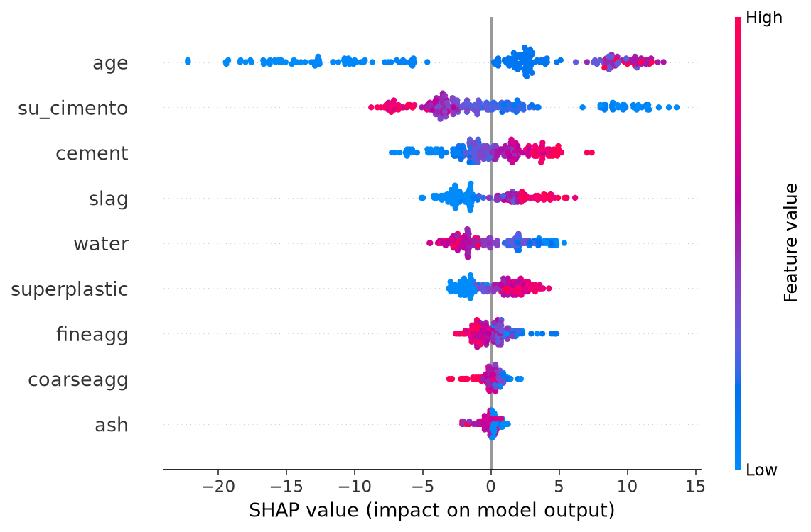

# Betonun 28 gün sırrı: basınç dayanımını makine öğrenmesiyle tahmin etmek

Şantiyede beton dökümü olan her gün aynı ritüel vardır. Mikserden numune alınır, küp kalıplara konur, kalıplar kür havuzuna gider ve 28 gün beklenir. Kırım sonucu gelene kadar o betonun gerçekte ne kadar dayanım kazandığını kimse bilmez. Ben bu bekleyişe yıllardır alışığım ama TRAI bootcamp'inde makine öğrenmesini görünce aklıma takıldı: karışım reçetesine bakarak sonucu önceden kestirmek mümkün mü? Final ödevi için konu arıyordum, ikisi birleşti.

## Veri seti

Kaggle'da Concrete Compressive Strength diye geçen klasik bir veri seti buldum, orijinali UCI'da duruyor (Yeh, 1998). 1030 farklı beton karışımı var. Her satırda çimento, cüruf (slag), uçucu kül (ash), su, süperakışkanlaştırıcı, iri ve ince agrega miktarları kg/m3 cinsinden, betonun yaşı gün cinsinden, hedef değişkenimiz olan basınç dayanımı da MPa cinsinden. Orijinal sütun adları upuzun olduğu için kısa adlı bir kopyayla çalıştım.

Google Colab'da veriyi yükleyip ilk kontrolleri yaptım:

```python
df = pd.read_csv("concrete.csv")

# eksik veri kontrolü
if df.isna().any().any():
    df.dropna(inplace=True)
    print("nan değerleri veri setinden çıkardık")
else:
    print("nan değer bulunmuyor")
```

```
nan değer bulunmuyor
```

Eksik veri yok. Laboratuvar verisi olduğu için temiz gelmesi normal, sahadan toplanan veri olsaydı bu kadar rahat etmezdik.

## Grafikler ne anlatıyor

Dayanım değerleri 2.33 MPa ile 82.6 MPa arasında değişiyor, ortalama 35.8 MPa. Yani içinde adeta çamur gibi zayıf karışımlar da var, yüksek dayanımlı özel betonlar da.



Korelasyon matrisinde çimento ile dayanım arasında 0.50'lik pozitif, su ile dayanım arasında -0.29'luk negatif ilişki çıktı. Mikserin başında "su katma, dayanım düşer" tartışması yaşamamış şantiyeci yoktur. Aynı şeyin verinin içinden kendiliğinden çıkması hoş bir his.



Yaş sürekli bir değişken değil, numuneler belli günlerde kırılmış (3, 7, 28, 90 gün gibi). O yüzden yaş için scatter yerine boxplot çizdim, betonun zamanla dayanım kazandığı çok net görünüyor:



## Sıra modellerde

Hocanın regresyon dersindeki akışı takip ettim. Feature ve target ayrımı, train/test split, sonra modeller. Bu ilk üç model için ölçekleme yapmadım; düz doğrusal regresyon ve ağaç tabanlı modeller ölçekten etkilenmiyor. Lasso ve Ridge'e sıra gelince ölçekleme mecburen girecek, birazdan.

```python
X = df.drop("strength", axis=1)
y = df["strength"]
X_train, X_test, y_train, y_test = train_test_split(X, y, test_size=0.2, random_state=42)

linear_model = LinearRegression()

polynomial_model = Pipeline([
    ("poly", PolynomialFeatures(degree=2, include_bias=False)),
    ("linear", LinearRegression())
])

random_forest_model = RandomForestRegressor(n_estimators=100, random_state=42)
```

Üçünü de eğitip test setinde karşılaştırdım:

```
Doğrusal: mse: 95.97094009110681  --- R2: 0.627553179231485
Polynomial: mse: 56.22756958783419  --- R2: 0.7817904095484642
Random Forest: mse: 29.85660710009169  --- R2: 0.884131609184953
```

Doğrusal regresyonun R2'si 0.63'te kaldı. Açıkçası buna üzülmedim. Beton davranışının doğrusal olmadığını sahada az çok sezersiniz, çimentoyu iki katına çıkardığınızda dayanım iki katına çıkmaz. Mühendis olarak sezdiğim şeyi modelin de söylemesi hoşuma gitti. Polinom özelliklerle R2 0.78'e çıktı, random forest ise 0.88 ile açık ara en iyisi. RMSE üzerinden konuşursak doğrusal model ortalama 9.8 MPa sapıyor, random forest 5.5 MPa. C25 ile C30 arasındaki farkın 5 MPa olduğunu düşünürseniz hala ciddi bir hata, ama iyileşme büyük.

## Merak edip dereceyi artırınca

Polinomda degree=2 hocanın derste kullandığı değerdi. Ben dereceyi artırınca test skorunun hemen bozulacağını, kitaplardaki overfitting grafiğini canlı izleyeceğimi sanıyordum:

```
degree=2  train R2: 0.8074083482350378  --- test R2: 0.7817904095484642
degree=3  train R2: 0.917720828500071  --- test R2: 0.7941346300949605
degree=4  train R2: 0.9572962594133656  --- test R2: 0.8429169949568681
degree=5  train R2: 0.962933421181679  --- test R2: 0.7715531681394492
```

Beklediğim gibi olmadı. Degree 3 ve 4'te test skoru düşmek yerine yükseldi, bunu sindirmem zaman aldı çünkü ben düşsün diye bakıyordum. Asıl kırılma degree 5'te geldi: train R2 0.96'ya tırmanırken test R2 0.77'ye, yani degree 2'nin bile altına indi. Model ezberledikçe genellemeyi kaybediyor. Train ile test arasındaki makasın her adımda açılması da işin habercisiymiş, onu sonradan fark ettim.

## Model neye bakıyor

Random forest'ın feature importance çıktısında en önemli değişken age, hemen ardından cement geliyor:

```
age: 0.33379905117419173
cement: 0.32486949508886404
water: 0.12640345585926568
```



Bunu gören her şantiyeci başını sallar. Beton zamanla dayanım kazanır, kür süresi kritiktir. Kışın kür şartlarını tutturmak için betonun üstüne branda çektiğimiz geceleri hatırlayınca modelin yaşa bu kadar ağırlık vermesi bana çok mantıklı geldi. Gerçek ve tahmin değerlerini yan yana koyunca da noktalar 45 derece çizgisinin etrafında toplanıyor, sadece çok yüksek dayanımlı numunelerde model biraz altta kalıyor:



## Bir satırlık alan bilgisi: su/çimento oranı

Hoca öznitelik mühendisliği konusundan bahsederken en iyi özelliğin bazen veride hazır durmadığını, onu bizim türetmemiz gerektiğini söylemişti. Benim aklıma anında su/çimento oranı geldi. Şantiyede betonun kalitesini tek sayıyla konuşacaksak o sayı budur, literatürde Abrams kuralı diye geçer. Veride water ve cement ayrı sütunlar halinde var ama oranları yok. Bir satırla ekledim:

```python
df["su_cimento"] = df["water"] / df["cement"]
```

```
su_cimento - strength korelasyonu: -0.5006920163176751
water - strength korelasyonu: -0.28963338498530444
```

Su tek başına -0.29 korelasyon veriyordu, oran -0.50. Türettiğim sütun ham sudan çok daha güçlü bir sinyal taşıyor. Aynı bölünmeyle modelleri yeniden eğittim:

```
Doğrusal (8 özellik): R2: 0.627553179231485
Doğrusal (+su_cimento): R2: 0.6326431206688323
Random Forest (8 özellik): R2: 0.884131609184953
Random Forest (+su_cimento): R2: 0.8906354934364594
```



Doğrusal modelde beklediğim sıçrama olmadı, 0.628'den 0.633'e küçük bir kıpırdanma. Water ve cement zaten modelin içindeydi, oran onların bilgisinin bir kısmını tekrarlıyor. Random forest ise 0.884'ten 0.891'e çıktı. Küçük görünebilir ama bu satırın asıl değeri birazdan, hiperparametre aramasının kazandırdığıyla yan yana gelince ortaya çıkacak.

## Lasso'nun sildiği sütun

Derste görüp de ilk turda es geçtiğim iki model daha vardı: Lasso ve Ridge. İkisi de büyük katsayıları cezalandırıyor, Lasso ayrıca işe yaramaz gördüğü katsayıyı sıfıra çekebiliyor. Hocanın örneğinde ikisi de StandardScaler'lı pipeline içindeydi, önce sebebini anlamamıştım; ceza katsayı büyüklüğüne baktığı için ölçeği farklı sütunlar cezayı çarpıtıyormuş. Aynı pipeline'ı kurdum.

```
Lasso: mse: 95.15743205137355  --- R2: 0.6307102649366021
Ridge: mse: 94.65663132488955  --- R2: 0.6326537869885946
```

Skorlarda sürpriz yok, ikisi de düz doğrusal regresyonla aynı seviyede çünkü model hala doğrusal. Benim asıl merak ettiğim katsayılardı; büyüklüğe göre sıralayıp öne çıkanları veriyorum:

```
cement: 9.075844021790125
slag: 7.6739089535915745
age: 6.754773057460624
water: -3.591770542947741
coarseagg: -0.0
```

Lasso coarseagg'ın katsayısını sıfırlamış. Yani iri agrega miktarı dayanım tahminine bir şey katmıyor, at gitsin demiş. Kimse söylemeden modelin kendi özellik seçimini yapması Lasso'nun en sevdiğim tarafı oldu. Alpha'yı 0.1'den 1.0'a çıkarınca ash ve fineagg de sıfırlandı ama test R2 0.57'ye düştü. Ceza sertleşince model sadeleşiyor, performanstan yiyor.

## Tek bölünmeye ne kadar güvenmeli

Buraya kadar bütün skorlar tek bir train/test bölünmesinden geldi. random_state=42 yerine başka sayı yazsam skorlar da değişecek, peki hangisine inanacağız? Hocanın çapraz doğrulama dersindeki cevap k-fold: veriyi 5 parçaya böl, her turda farklı parçayı test için ayır, 5 skorun ortalamasına bak. Derste stratified k-fold da görmüştük, önce onu mu kullansam diye düşündüm, sonra taş yerine oturdu: stratified, sınıflandırmada her fold'un sınıf oranlarını koruması için var. Benim hedef değişkenim sürekli bir sayı, sınıf yok, düz KFold yeterli.

```python
kfold = KFold(n_splits=5, shuffle=True, random_state=42)
rf_cv = cross_val_score(RandomForestRegressor(n_estimators=100, random_state=42),
                        X_fe, y, cv=kfold, scoring="r2")
```

```
Doğrusal: ortalama R2: 0.6034868541679475  --- std: 0.048557701126984223
Polynomial: ortalama R2: 0.7838406215196532  --- std: 0.02504206277598149
Random Forest: ortalama R2: 0.9052698002444369  --- std: 0.01459396528585783
```

Buradan iki şey öğrendim. Doğrusal modelin cv ortalaması 0.60, benim tek bölünmedeki 0.63'ün altında; demek ki test setim doğrusal model için şanslı bir bölünmeymiş. Random forest ise beş fold'da 0.88 ile 0.93 arasında gezip ortalama 0.91'e oturdu, sapması küçük. Tek sayı yerine ortalama ve sapmayı birlikte görmek daha güven veriyor.

## Aynı beton iki kere sayılmış olmasın?

k-fold sonucundan memnun ayrılırken bir şey takıldı kafama. Veri setinde yaş sütunu var ve 1, 3, 7, 28, 90, 365 gibi değerler alıyor. Şantiyede biz de böyle yaparız: bir dökümden numune alırız, aynı partiden bir küpü 7 günde, bir başkasını 28 günde kırarız. Yani aynı karışımın birden fazla satırı olabilir, sadece yaşları farklı. Öyleyse "1030 farklı beton karışımı" derken acaba yanılıyor muyum?

```python
karisim = [c for c in df.columns if c not in ("age", "strength", "su_cimento")]
grup = df.groupby(karisim, sort=False).ngroup()
print(f"{grup.nunique()} benzersiz karışım / {len(df)} satır")
```

```
427 benzersiz karışım / 1030 satır
181 karışım birden fazla yaşta ölçülmüş, 784 satır
en çok tekrar eden karışım: 20 satır
```

Yanılmışım. 1030 satır sandığım şey aslında 427 karışım; satırların dörtte üçü tekrar eden karışımlara ait ve bir tanesinin tam 20 satırı var.

Bu k-fold'u bozuyor. Veriyi rastgele böldüğümde aynı karışımın 7 günlük hâli eğitime, 28 günlük hâli teste düşebiliyor. Model o karışımın reçetesini zaten görmüş oluyor, test setinde karşılaştığı şey ona yabancı değil. Sınava girmeden soruların bir kısmını görmek gibi.

Doğrusu, aynı karışımın bütün satırlarını aynı fold'da tutmak. sklearn'de bunun adı GroupKFold:

```python
rf_grup = cross_val_score(RandomForestRegressor(n_estimators=100, random_state=42),
                          X_fe, y, cv=GroupKFold(n_splits=5), groups=grup, scoring="r2")
```

```
KFold      ortalama R2: 0.9053   rmse: 5.12
GroupKFold ortalama R2: 0.8903   rmse: 5.50
```

Fark yıkıcı değil ama var: R2 0.905'ten 0.890'a, rmse 5.12'den 5.50 MPa'ya. Yani buraya kadar yazdığım skorlar bir miktar iyimsermiş. Dürüst rakam 0.89 ve 5.5 MPa.

Bulduğumda ilk hissim keyifsizlik oldu, sonra geçti. Skorun düşmesi kötü haber değil, gerçek haber; hocaya 0.91 diye sunup içimde şüphe kalmasındansa 0.89 deyip arkasında durmayı tercih ederim. Bir de şu var: bu hatayı bana istatistik bilgim değil, şantiye alışkanlığım buldurdu. Veriye bakıp "bu bir döküm, üç ayrı kırım" diye düşünmek. Yukarıda su/çimento için söylediğim şey burada da çıktı karşıma.

Devam eden bölümlerde tek train/test bölünmesinin skorlarını kullanmaya devam ediyorum, modeller arası karşılaştırma için o yeterli. Ama "bu model gerçekte ne kadar isabetli" sorusunun cevabı 0.89.

## 0.88'in üstüne çıkabildim mi

Modelleri ilk kurduğumda kafama takılan soru şuydu: n_estimators ve max_depth ile oynasam daha yukarı çıkar mıyım? Bu iş için iki hazır araç var. GridSearchCV her kombinasyonu tek tek dener; benim seçtiğim aralıklarla bu 108 kombinasyon çarpı 5 fold demek. RandomizedSearchCV ise içlerinden rastgele 10 tanesine bakıyor; o kadar kombinasyonu beklemeye niyetim yoktu, onu seçtim. Burada dürüst bir itiraf: grid search'ün en iyi özellikleri seçtiğini sanıyordum bir ara. Öyle değil, özellik seçmiyor, modelin ayar düğmeleriyle oynuyor. Özellik işini Lasso ya da bizim su_cimento gibi elle türetilen sütunlar görüyor.

```python
random_search = RandomizedSearchCV(
    estimator=RandomForestRegressor(random_state=42),
    param_distributions=param_distributions,
    n_iter=10, cv=5, scoring="r2", random_state=42, n_jobs=-1
)
```

Sonucun özeti şu (defterde tablo halinde duruyor):

```
cv en iyi score: 0.9109  --- test score: 0.8931
en iyi parametre seti: {'n_estimators': 300, 'min_samples_split': 2,
                        'max_features': 0.5, 'max_depth': None}
```

Cevap: çıkabildim ama kıl payı. Test R2 0.891'den 0.893'e geldi, rmse 5.25 MPa. Asıl ders sayıların yan yana halinde: su_cimento sütunu skoru 0.884'ten 0.891'e taşımıştı, on kombinasyonluk arama üstüne ancak 0.002 koyabildi. Bir satırlık alan bilgisi, parametre kurcalamaktan daha çok kazandırdı.

## SHAP: önem değil, yön

Feature importance hangi değişkenin önemli olduğunu söylüyor ama hangi yöne ittiğini söylemiyor. age önemliymiş, tamam, peki yaş artınca tahmin artıyor mu azalıyor mu? Sezgiyle biliyorum ama modelin ağzından duymuş olmuyorum. Eğitimin sonlarına doğru gördüğümüz SHAP tam bunu yapıyor: her tahmin için her değişkenin katkısını yönüyle beraber çıkarıyor.

```python
shap_explainer = shap.TreeExplainer(en_iyi_rf)
shap_values = shap_explainer.shap_values(X_test_fe)
shap.summary_plot(shap_values, X_test_fe)
```

Sınıflandırmada shap_values sınıf başına ayrı matris döndürdüğü için hoca derste dallanma yazmıştı; regresyonda o dert yok, (206, 9) boyutlu tek matris geliyor.



Her nokta bir test örneği, renk değişkenin değerini gösteriyor. age satırında kırmızılar (yaşlı numuneler) sağda, tahmini yukarı itiyor. su_cimento'da tam tersi, kırmızılar solda: oran büyüdükçe dayanım tahmini aşağı iniyor. Mikserin başındaki tartışmanın modeldeki karşılığı bu. Beni asıl sevindiren, kendi eklediğim su_cimento'nun age'den sonra ikinci en etkili değişken çıkması. Alan bilgisi modele girmiş ve model onu kullanmayı seçmiş.

## Peki bu ne işe yarar

Dürüst olayım, bu model numune testinin yerini tutmaz. Şartnameler gerçek basınç deneyi ister ve kimse bir yapıyı "model 42 MPa dedi" diye teslim almaz, almamalı da. Ama kullanım yeri yok değil. Yeni bir karışım reçetesi denerken 28 gün beklemeden kabaca bir fikir verebilir, santralde reçete denemeleri yapılırken hangi karışımların umut vaat ettiğini önceden eleyebilir. Ben bunu bir ön kontrol aracı olarak görüyorum.

Bu ödevden bana kalan da net: en büyük kazancı ne model değiştirmek ne ayar çekmek getirdi, veriye bir satır saha bilgisi eklemek getirdi. Sıradaki hedefim veriyi değiştirmek. Bizim santralin reçeteleri ve kırım raporları arşivde duruyor; oradan kendi veri setimi derleyip modeli bir de onun üstünde denemek istiyorum. Laboratuvar verisinde 0.89 gören model bizim sahada ne yapacak, asıl merak ettiğim o.

Veri seti Kaggle'da (https://www.kaggle.com/datasets/elikplim/concrete-compressive-strength-data-set) ve orijinali UCI'da (https://archive.ics.uci.edu/dataset/165/concrete+compressive+strength). Bütün defteri GitHub'a yükledim (beton_dayanimi_tahmini.ipynb), yazıdaki grafikler de orada. Modeli tarayıcıda deneyebileceğiniz küçük bir demo da hazırladım; reçeteyi girince tahminin yanında TS EN 206-1'e göre hangi dayanım sınıfına karşılık geldiğini ve etki sınıfı sınırlarını da gösteriyor.

Bu yazıyı, Türkiye Yapay Zeka Akademisi ve Huawei Student Developers'ın ortak düzenlediği Veri Bilimi ve Makine Öğrenmesi Bootcamp'inin final çalışması olarak hazırladım.

Furkan Şenyüz
